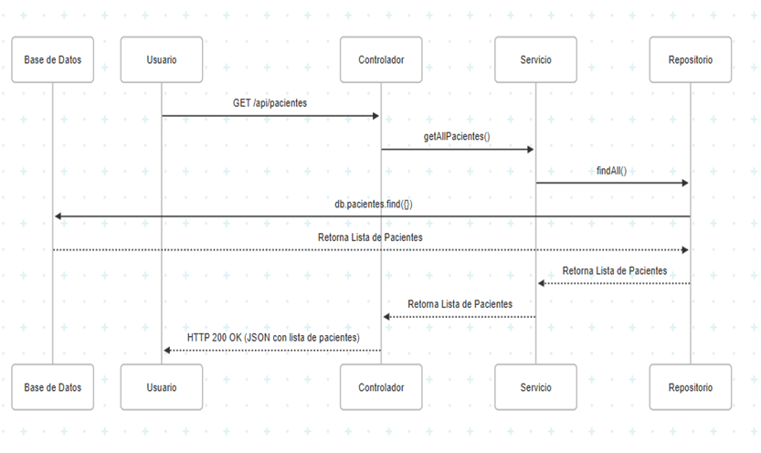
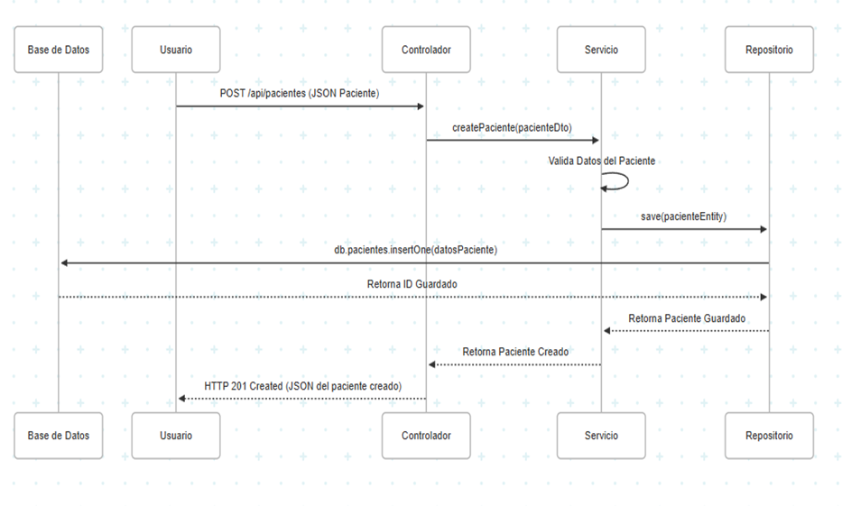

# PagoClinica
## Resumen
El proyecto PagoClinica es un sistema backend robusto diseñado para la gestión integral de pagos, citas y pacientes dentro de un entorno clínico. Su propósito principal es automatizar y centralizar el registro, la consulta, la actualización y el reporte de información financiera y administrativa. Esto incluye la capacidad de procesar pagos, gestionar el estado de las citas (tanto internas como externas), y generar informes de ingresos detallados, facilitando la operación diaria de la clínica y mejorando la eficiencia en la administración de datos de pacientes.

## Características
- Gestión Completa de Pagos: Permite la creación, consulta (por ID y general), actualización y gestión del estado de los pagos, incluyendo la funcionalidad para marcar pagos como "Pagado".

- Gestión de Citas Integrada: Facilita la consulta de citas, incluyendo la distinción entre citas externas e internas, y la capacidad de actualizar el estado de las citas externas.

- Reportes Financieros Detallados: Genera informes de ingresos totales y desglosados por fecha, proporcionando una visión clara del rendimiento financiero.

- Gestión de Pacientes Externos: Permite la consulta de pacientes que pueden provenir de sistemas externos, asegurando una visión consolidada.

- Validación de Datos: Implementa validaciones para asegurar la integridad y el formato correcto de los datos de entrada en todos los endpoints.

- Arquitectura en Capas: Construido sobre una arquitectura limpia que promueve la separación de responsabilidades, el bajo acoplamiento y la facilidad de mantenimiento y escalabilidad.

## Tecnologías
Para el desarrollo y ejecución del proyecto, se utilizan las siguientes tecnologías:

- Lenguaje de Programación: JAVA (Se recomienda Java 11 o superior para compatibilidad con Spring Boot).
  
- Framework: Spring Boot (Versión 2.x o superior, para el desarrollo rápido de APIs RESTful).
  
- Base de Datos: MySQL (Base de datos relacional, utilizada para la persistencia de datos).
  
- Herramienta de Construcción: Maven (Para la gestión de dependencias, compilación y empaquetado del proyecto).
  
- Herramienta de Desarrollo (IDE): IntelliJ IDEA (Recomendado, aunque compatible con otros IDEs como Eclipse o VS Code con plugins Java).

## Instalación
Para poner en marcha la API de PagoClinica en tu entorno local, sigue estos pasos detallados:

Clonar el Repositorio:
Abre tu terminal o Git Bash y ejecuta el siguiente comando para descargar el código fuente del proyecto:
```sh
git clone https://github.com/SantyR12/pago-clinica.git
```
Navegar al Directorio del Proyecto:
Ingresa al directorio recién clonado:

```sh
cd pago-clinica
```
Configurar MySQL (Localmente):

Instalación: Asegúrate de tener MySQL Server instalado y en ejecución en tu máquina. Puedes descargarlo desde MySQL Downloads.

Crear Base de Datos y Usuario: Crea una base de datos con el nombre de pagoclinica.

Configuración en la Aplicación: Modifica el archivo src/main/resources/application.properties para configurar la conexión a MySQL. Ejemplo para application.properties:
```sh
spring.application.name=pagoclinica
server.port=8090


spring.datasource.url=jdbc:mysql://localhost:3306/pagoclinica?useSSL=false&serverTimezone=UTC
spring.datasource.driverClassName=com.mysql.cj.jdbc.Driver
spring.datasource.username=root
spring.datasource.password=root


spring.jpa.show-sql=true
spring.jpa.hibernate.ddl-auto=update


spring.jpa.database-platform=org.hibernate.dialect.MySQL8Dialect

logging.level.org.springframework.web=DEBUG
debug=true
citas.service.url=http://localhost:8082/
```


## Uso REST API
La API de PagoClinica expone una serie de endpoints RESTful para interactuar con los recursos de pagos, citas y reportes. A continuación, se detallan los endpoints principales, sus métodos HTTP, URLs, ejemplos de cuerpos de solicitud y posibles respuestas, basados en la colección de Postman proporcionada.

## Pagos
### Obtener todos los pagos

- Descripción: Recupera una lista de todos los registros de pagos existentes en el sistema.

- Método HTTP: GET

- URL: http://localhost:8090/pagos

- Request Body: N/A

Ejemplo de Respuesta (HTTP 200 OK):
```sh
[
    {
        "citaId": 1,
        "pacienteId": 1,
        "fechaPago": "2025-05-10",
        "metodoPago": "Tarjeta",
        "monto": 1200011,
        "estadoPago": "nulo",
        "referencia": "REF-PAGO-ABC-123"
    },
    {
        "citaId": 2,
        "pacienteId": 2,
        "fechaPago": "2025-05-15",
        "metodoPago": "Efectivo",
        "monto": 75000,
        "estadoPago": "Pagado",
        "referencia": "REF-PAGO-DEF-456"
    }
]
```
### Obtener pago por ID

- Descripción: Recupera los detalles de un pago específico utilizando su identificador único.

- Método HTTP: GET

- URL: http://localhost:8090/pagos/{id} (Ejemplo: http://localhost:8090/pagos/1)

- Request Body: N/A

Ejemplo de Respuesta (HTTP 200 OK):
```sh
{
    "citaId": 1,
    "pacienteId": 1,
    "fechaPago": "2025-05-10",
    "metodoPago": "Tarjeta",
    "monto": 1200011,
    "estadoPago": "nulo",
    "referencia": "REF-PAGO-ABC-123"
}
```
- Posible Respuesta (HTTP 404 Not Found): Si el ID no existe.

### Registrar un nuevo pago

- Descripción: Crea un nuevo registro de pago en el sistema.

- Método HTTP: POST

- URL: http://localhost:8090/pagos

Request Body (application/json):
```sh
{
    "citaId": 1,
    "pacienteId": 1,
    "fechaPago": "2025-05-26",
    "metodoPago": "Efectivo",
    "monto": 50000,
    "estado": "Pendiente",
    "referencia": "REF-PAGO-XYZ-789"
}
```
Ejemplo de Respuesta (HTTP 200 OK / 201 Created):
```sh
{
    "id": "60c72b2f9b1e8b001f8e1a2b", // ID generado por la base de datos
    "citaId": 1,
    "pacienteId": 1,
    "fechaPago": "2025-05-26",
    "metodoPago": "Efectivo",
    "monto": 50000,
    "estado": "Pendiente",
    "referencia": "REF-PAGO-XYZ-789"
}
```
- Posible Respuesta (HTTP 400 Bad Request): Si el cuerpo de la solicitud es inválido o faltan campos requeridos.

### Actualizar un pago existente

- Descripción: Actualiza la información de un pago específico identificado por su ID.

- Método HTTP: PUT

- URL: http://localhost:8090/pagos/{id} (Ejemplo: http://localhost:8090/pagos/4)

Request Body (application/json):
```sh
{
    "citaId": 1,
    "pacienteId": 1,
    "fechaPago": "2025-05-26",
    "metodoPago": "Efectivo",
    "monto": 500001,
    "estado": "Pendiente",
    "referencia": "REF-PAGO-XYZ-789"
}
```
Ejemplo de Respuesta (HTTP 200 OK):
```sh
{
    "id": "4", // ID del pago actualizado
    "citaId": 1,
    "pacienteId": 1,
    "fechaPago": "2025-05-26",
    "metodoPago": "Efectivo",
    "monto": 500001,
    "estado": "Pendiente",
    "referencia": "REF-PAGO-XYZ-789"
}
```
Posible Respuesta (HTTP 404 Not Found): Si el ID no existe.

### Marcar un pago como "pagado"

- Descripción: Actualiza el estado de un pago a "Pagado" y permite especificar el método de pago final.

- Método HTTP: PUT

0 URL: http://localhost:8090/pagos/{id}/pagar (Ejemplo: http://localhost:8090/pagos/3/pagar)

Request Body (application/json):
```sh
{
    "metodoPago": "Tarjeta de Crédito"
}
```
Ejemplo de Respuesta (HTTP 200 OK):
```sh
{
    "id": "3", // ID del pago
    "citaId": 1,
    "pacienteId": 1,
    "fechaPago": "2025-05-26",
    "metodoPago": "Tarjeta de Crédito",
    "monto": 50000,
    "estado": "Pagado", // El estado se actualiza a "Pagado"
    "referencia": "REF-PAGO-XYZ-789"
}
```
Posible Respuesta (HTTP 404 Not Found): Si el ID no existe.

## Citas
### Obtener todas las citas externas

- Descripción: Recupera una lista de todas las citas consideradas como "externas" al sistema principal de pagos.

- Método HTTP: GET

- URL: http://localhost:8090/pagos/citas-externas

- Request Body: N/A

Ejemplo de Respuesta (HTTP 200 OK):
```sh
[
    {
        "citaId": 1,
        "pacienteId": 1,
        "fechaCita": "2025-06-01",
        "servicio": "Consulta General",
        "estadoCita": "Confirmada"
    }
    // ... más citas externas
]
```
### Obtener cita por ID

- Descripción: Recupera los detalles de una cita específica utilizando su identificador único.

- Método HTTP: GET

- URL: http://localhost:8090/pagos/cita/{id} (Ejemplo: http://localhost:8090/pagos/cita/1)

- Request Body: N/A

Ejemplo de Respuesta (HTTP 200 OK):
```sh
{
    "citaId": 1,
    "pacienteId": 1,
    "fechaCita": "2025-06-01",
    "servicio": "Consulta General",
    "estadoCita": "Confirmada"
}
```
Posible Respuesta (HTTP 404 Not Found): Si el ID no existe.

### Actualizar estado de citas externas

- Descripción: Permite actualizar el estado de una cita externa específica.

- Método HTTP: PUT

- URL: http://localhost:8090/pagos/citas-externas/{id}/estado (Ejemplo: http://localhost:8090/pagos/citas-externas/1/estado)

Request Body (application/json):
```sh
{
    "estadoPago": "Pagado" // O "Anulado", "Pendiente" según la lógica de negocio
}
```
Ejemplo de Respuesta (HTTP 200 OK):
```sh
{
    "citaId": 1,
    "pacienteId": 1,
    "fechaCita": "2025-06-01",
    "servicio": "Consulta General",
    "estadoCita": "Pagado" // Estado actualizado
}
```
Posible Respuesta (HTTP 404 Not Found): Si el ID no existe.

## Reportes
### Reporte de ingresos total

- Descripción: Calcula y devuelve el monto total de ingresos registrados en el sistema.

- Método HTTP: GET

- URL: http://localhost:8090/pagos/reporte/ingresos

- Request Body: N/A

Ejemplo de Respuesta (HTTP 200 OK):
```sh
{
    "totalIngresos": 1500000.75 // Monto total acumulado
}
```
### Reporte de ingresos por fecha

- Descripción: Calcula y devuelve el monto total de ingresos para una fecha específica.

- Método HTTP: GET

- URL: http://localhost:8090/pagos/reporte/ingresos/por-fecha?fecha=YYYY-MM-DD

- Ejemplo: http://localhost:8090/pagos/reporte/ingresos/por-fecha?fecha=2025-05-10

- Request Body: N/A

Ejemplo de Respuesta (HTTP 200 OK):
```sh
{
    "ingresosFecha": 1200011.00 // Ingresos para la fecha especificada
}
```
### Desglose de ingresos por fechas

- Descripción: Proporciona un desglose de los ingresos, agrupados por fecha.

- Método HTTP: GET

- URL: http://localhost:8090/pagos/reporte/ingresos/desglose-fechas

- equest Body: N/A

Ejemplo de Respuesta (HTTP 200 OK):
```sh
{
    "2025-05-10": 1200011.00,
    "2025-05-15": 75000.00,
    "2025-05-26": 50000.00
    // ... más fechas y sus ingresos
}
```
## Pacientes Externos
### Obtener pacientes externos

- Descripción: Recupera una lista de pacientes que son considerados "externos" al sistema principal de pagos.

- Método HTTP: GET

- URL: http://localhost:8090/pagos/pacientes-externos

- Request Body: N/A

Ejemplo de Respuesta (HTTP 200 OK):
```sh
[
    {
        "pacienteId": 1,
        "nombre": "Paciente Externo A",
        "identificacion": "123456789",
        "tipoPaciente": "Externo"
    }
    // ... más pacientes externos
]
```
## Arquitectura
La arquitectura de PagoClinica sigue un patrón de diseño en capas, promoviendo la separación de preocupaciones, la modularidad y la facilidad de mantenimiento. Se adhiere a los principios de una "arquitectura limpia", donde las dependencias fluyen hacia adentro, asegurando que las capas internas no dependan de las externas.

- ### Controladores (Controllers): (src/main/java/com/clinica/controller)

  - Responsabilidad: Son la interfaz de la API. Reciben las solicitudes HTTP de los clientes, validan los datos de entrada básicos y delegan la lógica de negocio a la capa de Servicios.

  - Tecnología: Anotaciones de Spring MVC (@RestController, @RequestMapping, etc.).

- ### Servicios (Services): (src/main/java/com/clinica/service)

  - Responsabilidad: Contienen la lógica de negocio principal de la aplicación. Coordinan las operaciones entre los controladores y los repositorios, aplican reglas de negocio, realizan validaciones más complejas y transformaciones de datos.

  - Tecnología: Clases de servicio de Spring (@Service).

- ### Repositorios (Repositories): (src/main/java/com/clinica/repository)

  - Responsabilidad: Son la capa de acceso a datos. Interactúan directamente con la base de datos (MySQL) para realizar operaciones CRUD (Crear, Leer, Actualizar, Borrar) y consultas. Abstraen los detalles de la persistencia de las capas superiores.

  - Tecnología: Spring Data JPA con MySQL (interfaces que extienden JpaRepository).

- ### Dominio / Modelos (Models): (src/main/java/com/clinica/model)

  - Responsabilidad: Contienen las clases que representan las entidades de negocio del dominio (ej., Pago, Cita, Paciente). Estas clases definen la estructura de los datos que se manipulan a través de las capas.

  - Tecnología: Clases POJO (Plain Old Java Objects) con anotaciones de JPA para mapeo a tablas de MySQL (@Entity, @Id, @Table).

## Diseño Detallado
- Uso de MySQL: Se optó por MySQL como base de datos relacional. Esta elección se basa en su robustez, madurez, soporte ACID (Atomicidad, Consistencia, Aislamiento, Durabilidad) y su capacidad para manejar transacciones complejas y relaciones de datos bien definidas, lo que la hace ideal para sistemas que requieren alta integridad de datos y consultas estructuradas.

- Cloud: Para el despliegue en la nube, la aplicación está desplegada en Railway. El link de la aplicación desplegada es: adequate-appreciation-production.up.railway.app

## Diagramas de secuencia
Un diagrama de secuencia muestra cómo se comunican los objetos, por medio de la misma se logra reconocer la manera en la que intercambian mensajes entre sí, detallando el comportamiento de nuestra aplicación.

## Request GET



## Request POST



## Estructura del Proyecto
La estructura de carpetas utilizada es orientada al Dominio, y se incluye una arquitectura limpia en la que intervienen 3 capas principales: Controladores, Repositorios y los Servicios. Esto nos permite un bajo acoplamiento ya que las dependencias solo se hacen entre la capa contigua de nivel inferior, de esta manera hay independencia entre los módulos.

```sh
pago-clinica/
├── src/
│   ├── main/
│   │   ├── java/
│   │   │   └── com/
│   │   │       └── clinica/
│   │   │           ├── controller/     
│   │   │           │   └── PagoClinicaController.java
│   │   │           ├── domain/     
│   │   │           │   ├── dto/       
│   │   │           │   │   ├── CitaDTO.java
│   │   │           │   │   ├── EstadoPagoCitaRequestDTO.java
│   │   │           │   │   ├── IngresosPorFechaDTO.java
│   │   │           │   │   ├── PacienteDTO.java
│   │   │           │   │   ├── PagoDTO.java
│   │   │           │   │   └── ResumenDiarioIngresosDTO.java
│   │   │           │   ├── repository/ 
│   │   │           │   │   └── IPayClinical.java
│   │   │           │   └── service/    
│   │   │           │       └── PayClinicalService.java
│   │   │           ├── infraestructura/
│   │   │           │   ├── client/    
│   │   │           │   │   ├── CitaCliente.java
│   │   │           │   │   └── PacienteCliente.java
│   │   │           │   ├── crud/       
│   │   │           │   │   └── PagoRepository.java
│   │   │           │   ├── entity/    
│   │   │           │   │   └── PagoClinica.java
│   │   │           │   ├── mapper/     
│   │   │           │   │   └── PagoClinicaMapper.java
│   │   │           │   └── repositories/ 
│   │   │           │       └── PayClinicalImpl.java
│   │   │           └── PagoclinicaApplication.java 
│   │   └── resources/
│   │       ├── diagrams/            
│   │       │   ├── secuencial.png
│   │       │   ├── secuencia2.png
│   │       │   └── usuario.png
│   │       └── application.properties  
│   └── test/
│       └── java/
│           └── com/
│               └── clinica/
│                   └── PagoclinicaApplicationTests.java 
├── .github/                        
├── .mvn/                           
├── mvnw                            
├── mvnw.cmd                        
├── pagoulti.postman_collection.json 
├── pom.xml                         
└── README.md                                             
```
